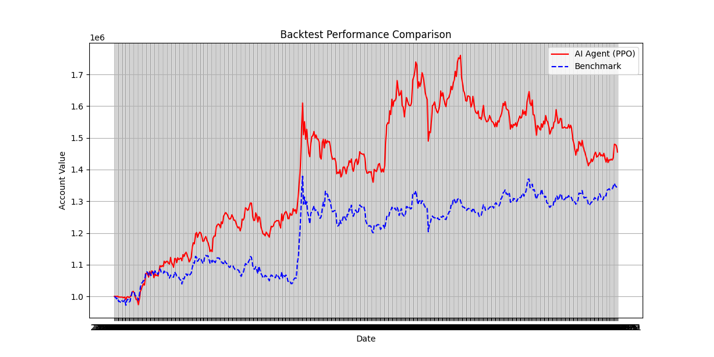
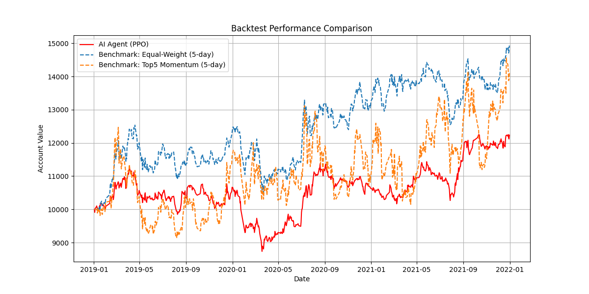
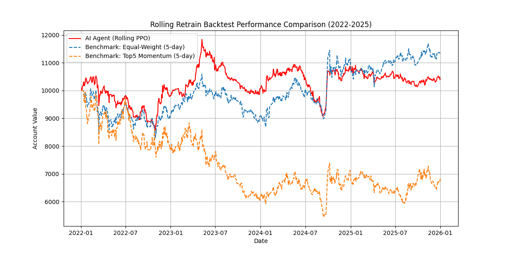

# Development Log

## 2026-01-29
- Rearranged the structure. 根据实际情况重新编排了文件夹结构。
- Ran MVP successfully, training results obtained. 成功跑通MVP流程，拿到了训练结果。
- Updated requirements.txt, README.md 更新了requirements.txt和README.md等文件。
- Checked PPO output in backtest. 检查了PPO在回测中的输出结果。

## 2026-03-03
- Fixed backtest execution path. Solved the issue where account value was reset to one day after evaluation. 修复了回测执行链路，解决了评估后净值只剩一天的问题。
- Added backtest diagnostics CSV outputs (actions / trades / holdings) for analysis. 新增回测诊断表（动作/成交/持仓）CSV输出，便于定位策略行为与成本影响。
- Updated benchmark to fair setting (equal-weight daily rebalance with buy/sell costs). 将Benchmark更新为更公平口径（等权日频再平衡+双边手续费）。
- Ran end-to-end experiment successfully; PPO agent outperformed benchmark in latest run. 完整流程再次跑通，最新实验中PPO策略跑赢Benchmark。

## 2026-03-07
- Clarified project target as a deployable retail-scale prototype: fixed 40-stock pool + `Top-K` (`K=5`) selection, rebalanced every 5 trading days.
  明确项目目标为面向普通投资者的小资金可部署原型：固定40只股票池 + `Top-K`（`K=5`）选股，每5个交易日调仓。
- Refactored the project workflow: separated data fetch/cleaning from main training pipeline and updated project structure documentation.
  完成项目流程重构：将数据抓取与清洗从主训练流程中独立出来，并同步更新项目结构文档。
- Built the 40-stock universe from `selected_40_pool.xlsx` and completed end-to-end data fetching and processing.
  基于 `selected_40_pool.xlsx` 的股票池清单完成40只标的选取，并完成抓取与处理全流程。
- Updated `README.md` and `Development_log.md` with bilingual progress notes and latest project snapshot.
  已更新 `README.md` 与 `Development_log.md` 的说明及最新项目快照。

## 2026-03-08
- Implemented multi-seed (10 seeds) evaluation pipeline to verify strategy robustness and reproducibility. 实现了多随机种子（10个）评估流水线，以验证策略的鲁棒性与可复现性。
- Updated model saving logic to retain the median-performing agent based on Sharpe ratio. 更新了模型保存逻辑，基于夏普比率保留表现居中（中位数）的智能体。
- Updated the experiment logging system to systematically record all hyperparameters, environment configurations, and per-seed metrics. 更新了实验日志系统，系统性地完整记录所有超参数、环境配置及各个种子的性能指标。

## 2026-03-11
- Completed 4-year OOS evaluation (2022-2025) and saved reports/plots under docs/experiments. 完成2022-2025四年OOS评估并输出报告与图表至docs/experiments。
- Finished 10-seed rolling retrain experiments and generated seed-wise summaries and annual return comparison plot. 完成10个随机种子的滚动重训实验，并输出分种子汇总与年化收益率对比图。
- Selected the best-performing rolling model (seed7) as the candidate for upcoming live demo. 选定滚动重训中表现最佳的seed7模型，作为后续实机演示候选。
- Built the live demo pipeline with cold start, daily interaction, and local logs/plots under docs/live_demo. 完成实机演示流水线（冷启动、每日交互、日志与绘图输出至docs/live_demo）。
- Thesis workflow is now stable; next iterations will focus on model tuning and strategy design, with continuous updates. 毕业论文主体阶段告一段落，后续将持续推进模型调优与策略设计部分的更新。

